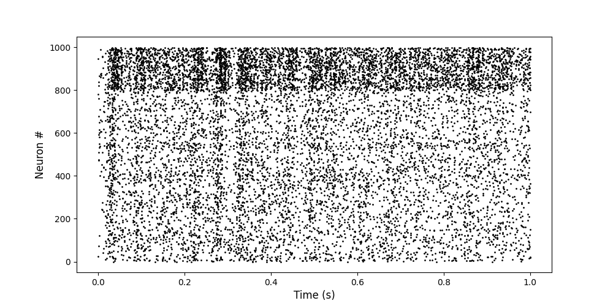

# soft-npu
*soft-npu* (software-based neural processing unit) is an event-driven framework for processing dynamics of spiking neural networks (SNNs).
This project is in early stage of development.

## Key Features

* Event-driven
* Leaky integrate-and-fire neurons
* Conduction delays
* Spike-timing-dependent plasticity modulated via dopamine-based signaling (R-STDP)
* Json-based configuration
* Tools for generating network topologies
* Tools for metaheuristic optimization of parameters

## Motivation
Inspiration for this projects originates from two publications by neuroscientist Eugene M. Izhikevich:
* Polychronization: Computation with Spikes [[1]](#1)
* Solving the Distal Reward Problem through Linkage of STDP and Dopamine Signaling [[2]](#2)

The aim is to explore the potential of emerging polychronous groups with R-STDP as a learning mechanism in SNNs.

## Example Spike Raster



## Usage
Below instructions should work on UNIX-based systems. Some dependencies may have to be installed.

```
# build
mkdir build
cd build
cmake -DCMAKE_BUILD_TYPE=Release .. # -DCMAKE_INSTALL_PREFIX=${HOME}/.local/
make # -j8

# run tests
make test

# run example
./src/nsim
```
Note: one of the dependencies is libcmaes, which is fetched and built on the fly if not present. This may take some time. If a local installation of libcmaes is already present, best to make it visible to cmake in the install prefix.

## References
<a id="1">[1]</a> 
Eugene M. Izhikevich (2006). Polychronization: Computation with Spikes. https://www.izhikevich.org/publications/spnet.pdf.

<a id="2">[2]</a> 
Eugene M. Izhikevich (2007). Solving the Distal Reward Problem through Linkage of STDP and Dopamine Signalings. https://www.izhikevich.org/publications/dastdp.pdf.
